# Native composer scroll regression

Commit: `b5e63f716`, pushed to `fix/new-workspace-composer-dock`.

The dock's dismiss surface is now a sibling behind the content. No JS responder from the dock sits above a native scroll view. New workspace's decorative form containers pass through empty-space touches on iOS; its controls remain touch targets. The `ComposerDock` interface, header dismissal, keyboard drivers, sizing model, and flick classifier are unchanged.

## Red / green

The same native swipe on `b68767635` changed **0.00%** of stream pixels, both from the bottom and after returning there and waiting for the scrollbar to fade. The new `stream-moved` assertion failed both captures. With the fix it changed **23.89%** and **26.44%**. [Raw assertion output](red-green.log).

The assertion ignores the scrollbar rail and requires at least 1% of pixels in the stream region to differ by more than 8 RGB levels. The host scenario submits a 50-line fixture through each real host, waits for the selectable mock model's response to finish and for JS/scrollbars to become idle, swipes natively, returns to the bottom, waits, and swipes again. Draft and New workspace submissions naturally transition to their new chats. Existing assertions, thresholds, inputs and gestures are unchanged.

| Reproduction | Before native swipe | After native swipe |
| --- | --- | --- |
| Broken branch, idle at bottom |  | 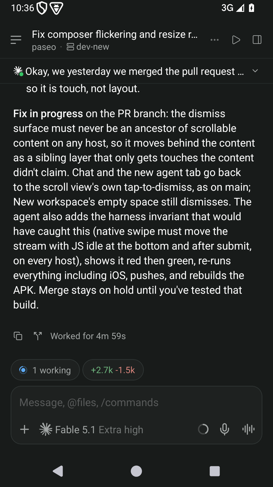 |
| Fixed branch, idle at bottom | 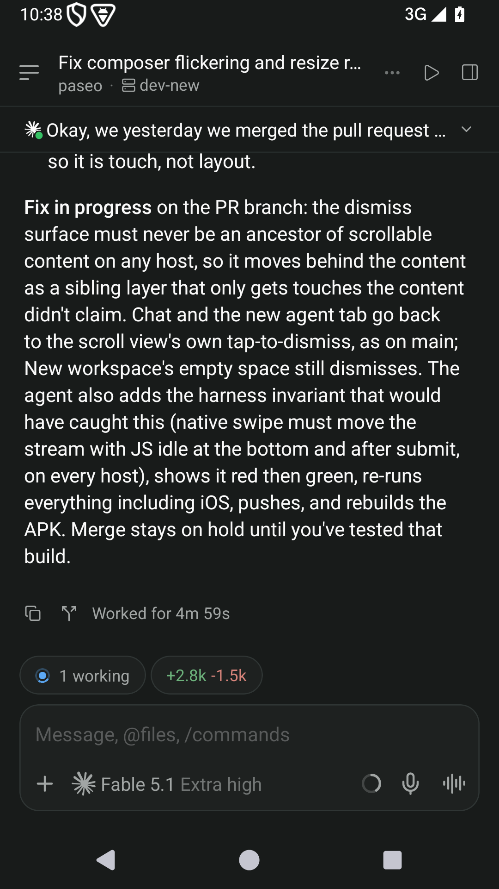 | 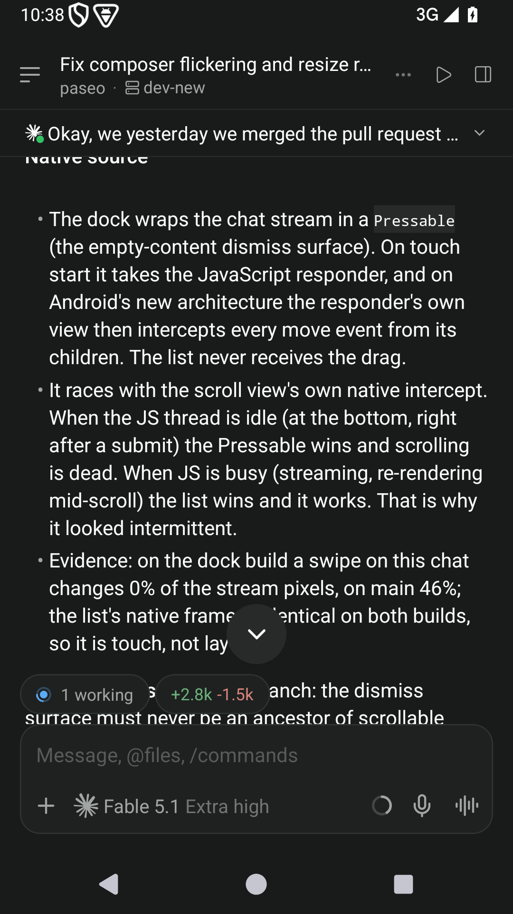 |

## Android

```sh
PASEO_COMPOSER_KEYBOARD_DAEMON_HOST=127.0.0.1:6768 \
PASEO_COMPOSER_KEYBOARD_DAEMON_HOME=/home/moboudra/dev/paseo/.dev/paseo-home \
npm run test:e2e:composer-keyboard:android
```

**Final full harness: exit 0** on `b5e63f716`. [Raw output](harness-final.log). All original steps passed, plus the common scenario on every host: growth, bounds, retained close/reopen height, hold-delete reset, content/header dismissal, JS-stall motion, and command/file/model/attachment/forge popovers in both keyboard states. The initial run was intentionally stopped after iOS exposed the empty-padding hit-test failure; this final run includes the correction.

| Origin host | Native swipe after submit | Native swipe after returning to bottom + idle |
| --- | ---: | ---: |
| Chat | 24.30% | 23.50% |
| New agent tab | 24.67% | 25.67% |
| New workspace | 24.05% | 24.33% |

```text
PASS host=chat: native stream swipe after submit and after idle at bottom
PASS host=workspace-draft: native stream swipe after submit and after idle at bottom
PASS host=new-workspace: native stream swipe after submit and after idle at bottom
Composer keyboard invariants passed
```

| Android idle swipe | Before | After |
| --- | --- | --- |
| Chat | 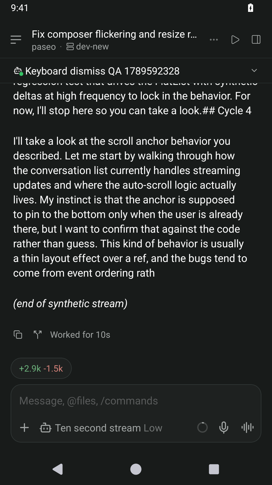 | 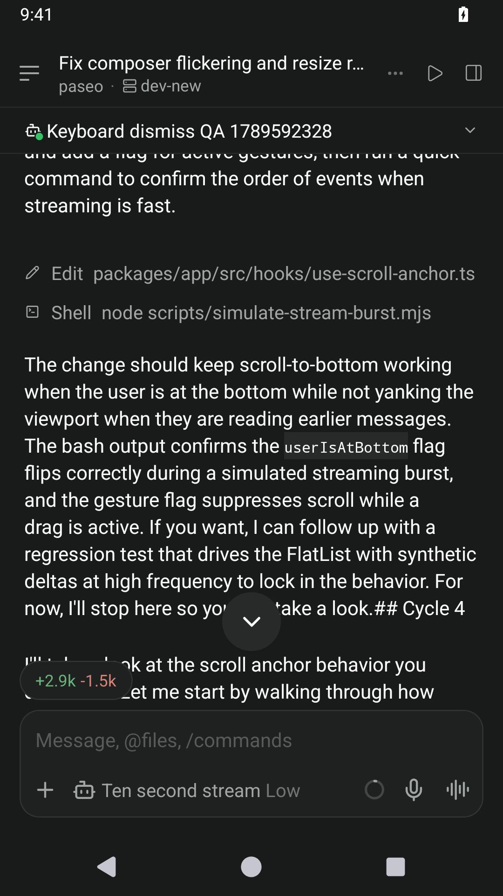 |
| New agent tab submission | 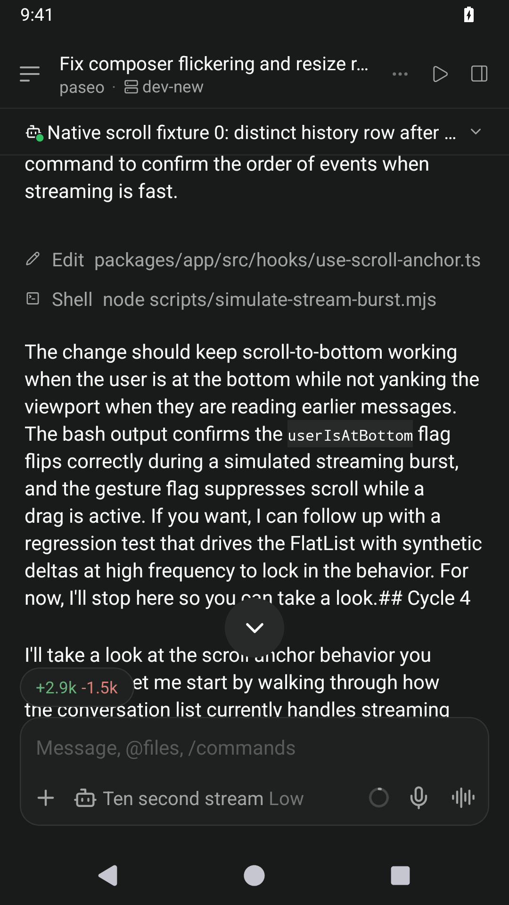 | 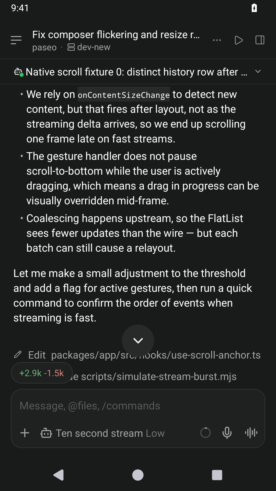 |
| New workspace submission | 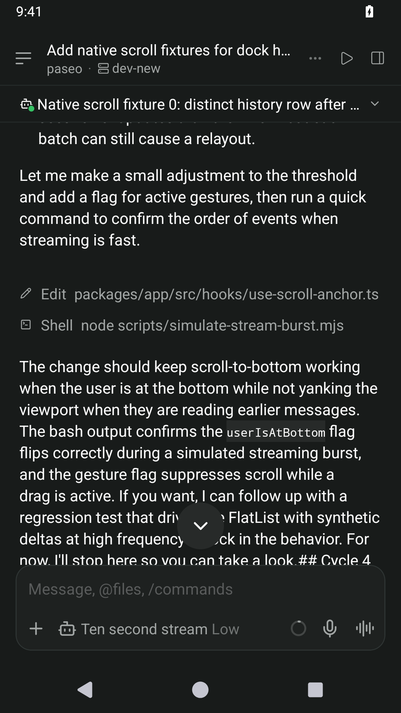 | 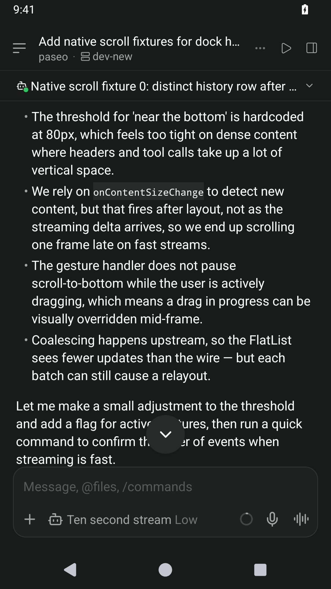 |

## iOS

iPhone 16 Pro, iOS 18.6, shared Namespace Mac, isolated `composer-scroll-ios` session. This checkout's Metro was tunneled on 8083 and the daemon on 17668. Both owned processes and the device session were closed afterward; other sessions were left alone.

Native stream displacement after submit: **28.64%**. After returning to the bottom and waiting: **29.79%**. Slow native pan with keyboard open: **27.82%**, keyboard remained open and input height remained 30 pt. [Native assertions](ios/native-scroll.log), [slow-scroll assertion](ios/slow-scroll.log), [gesture output](ios/composer-scroll-ios-gestures.log).

| Host | Empty/reset | Cap, after header dismissal, after reopen | Empty-content/header dismissal |
| --- | ---: | ---: | --- |
| Chat | 30 pt | 298 pt | Passed |
| New agent tab | 30 pt | 250 pt | Passed |
| New workspace | 30 pt | 333 pt | Passed |

The first sibling-only implementation failed New workspace's empty-content dismissal on iOS: decorative form padding intercepted hit testing. `box-none` on layout containers and `none` on inert title/spacers fixed that failure; no responder was added above content. [Failing dismissal output](ios/new-workspace-padding-red.log), [passing output](ios/composer-scroll-ios-workspace-final.log).

A 230-point automated iOS fling still left the keyboard open. The pre-existing classifier is unchanged, and automated iOS flick dismissal remains a QA gap previously recorded for the extraction. This report does not claim a passing flick-dismissal result. Android's existing flick assertions remain in the full harness.

| iOS state | Before | After |
| --- | --- | --- |
| Native swipe after submit | 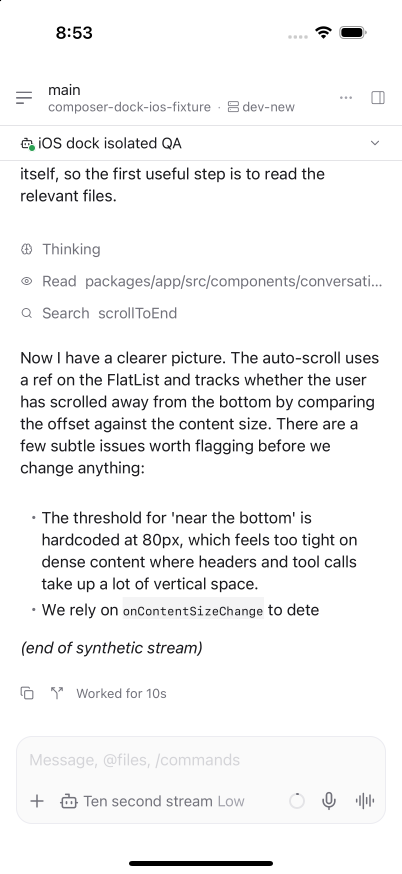 | 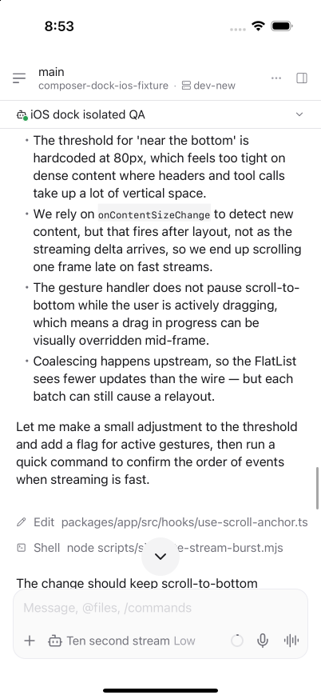 |
| Native swipe after idle at bottom | 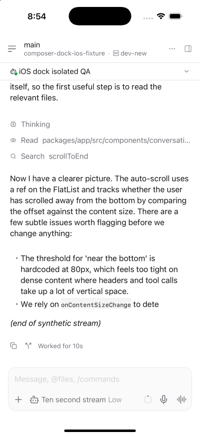 | 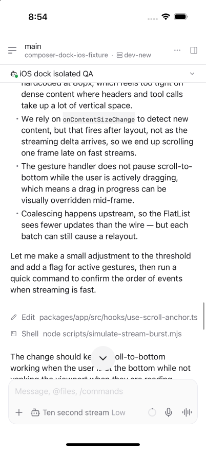 |
| Slow pan with keyboard open | 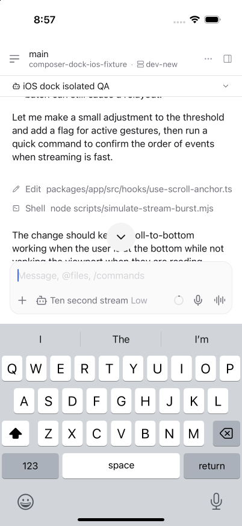 | 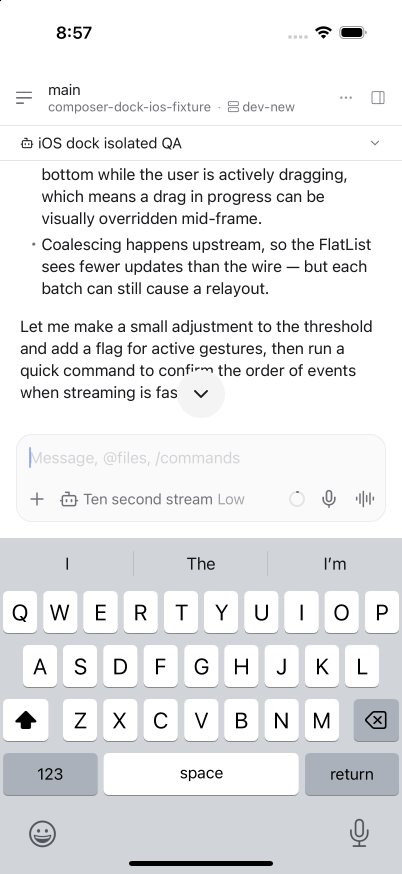 |
| Chat capped header dismissal | 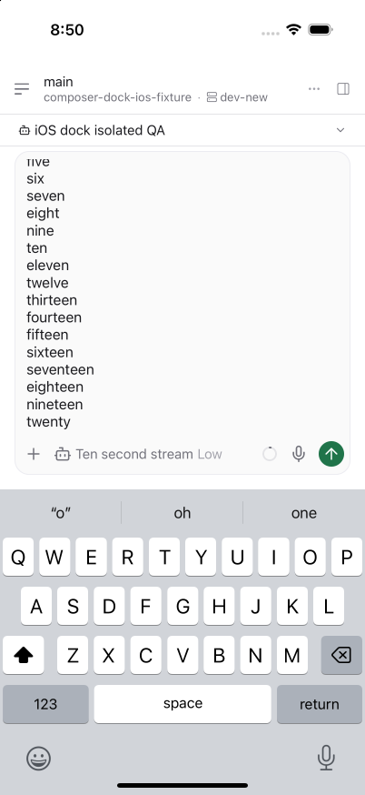 | 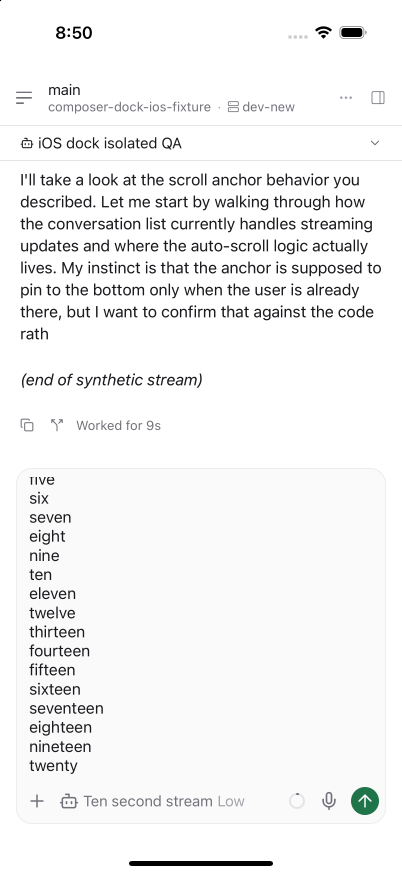 |
| New agent tab capped header dismissal | 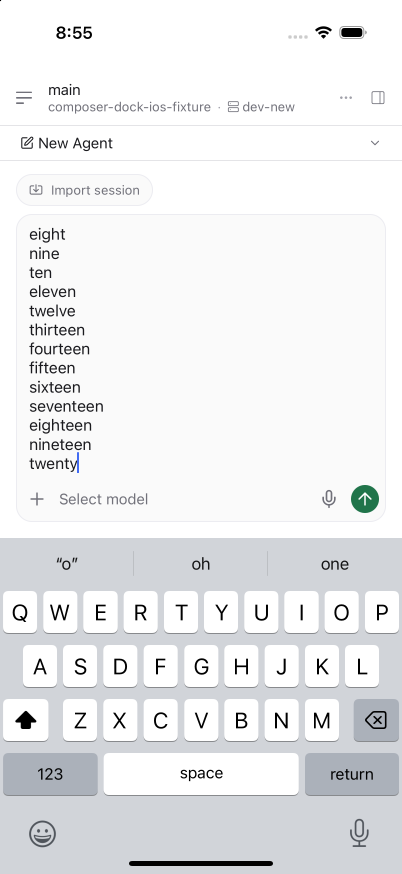 | 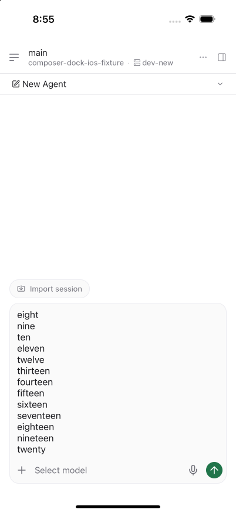 |
| New workspace capped header dismissal | 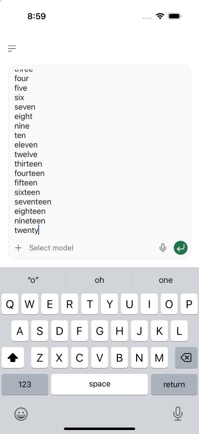 | 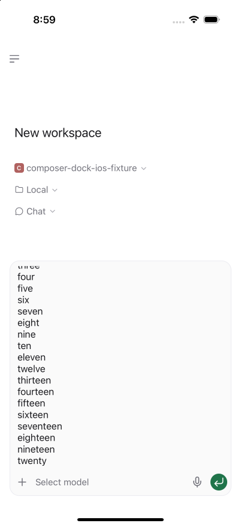 |

## Static checks

```text
npm run format: exit 0
npm run lint: exit 0; 0 warnings, 0 errors
npm run typecheck: exit 0; all workspaces
```

[Format](composer-scroll-format.log), [lint](composer-scroll-lint.log), [typecheck](composer-scroll-typecheck.log).

## Production APK

[Install the plain production APK](https://dev-new.tail8fe838.ts.net/paseo-composer-dock-b5e63f716.apk), built from pushed commit `b5e63f7160abe3fe3d7894fb603db2b3d2a2c219`. [Build output](release-build.log), [package metadata](apk-metadata.log), [HTTP verification](apk-http.log).

```sh
cd packages/app
npm --prefix ../.. run build:client && CI=1 APP_VARIANT=production npx expo prebuild --platform android --clean --non-interactive && cd android && ./gradlew assembleRelease --no-daemon -q
# exit 0; working tree clean afterward
# sh.paseo, version 0.8.0, versionCode 8000; target SDK 36; four ABIs
# HTTP 200, application/vnd.android.package-archive, 262457899 bytes
# SHA-256 b1ee48c1ddd16469ad0b2f257190bde4af3a1fd80666887b59a6a345bf3191a1
```

Installed this APK successfully on the emulator and reran the original reported reproduction. Native stream displacement: **27.74%** from a fresh bottom and **25.07%** after returning to the bottom and waiting. [Assertion output](release/assertions.log), [original reproduction output](release/reproduction.log).

| Production idle swipe | Before | After |
| --- | --- | --- |
| Rebuilt APK | 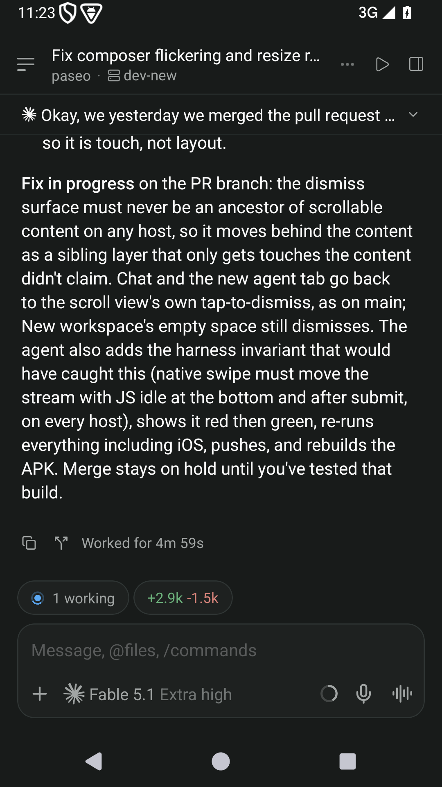 | 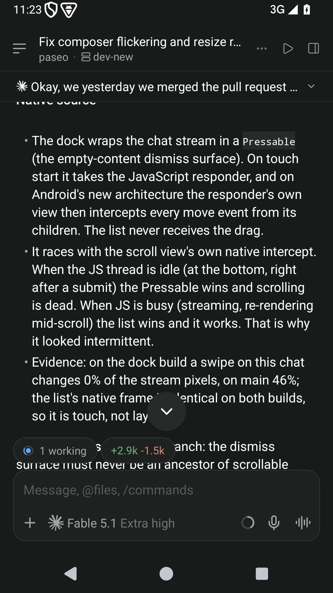 |

PR #4973 remains unmerged, pending physical-phone acceptance of this replacement APK.
